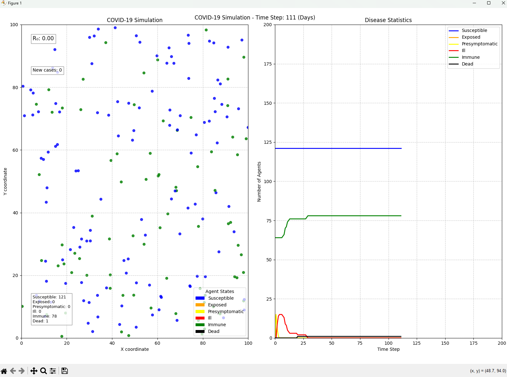

# COVID-19 Simulation



## About

This COVID-19 simulation began as a university semester project and evolved into a comprehensive study that completed my year of programming studies. It simulates how COVID-19 spreads through a population, helping visualize the impact of various interventions and parameters.

## Key Features

-   Agent-based modeling with realistic disease progression
-   Customizable environment and parameters
-   Interactive visualization and statistical analysis
-   Support for interventions like masks and vaccination

## Running the Simulation

Simply run `python main.py` to start with default settings, or use command-line options to customize:

```
python main.py --steps 300 --save-plots
```

The `config.yaml` file allows you to adjust population size, disease parameters, and visualization settings.

## Project Components

-   Simulation engine with realistic disease modeling
-   Statistical analysis calculating epidemic curves and R₀
-   Visualization tools for animation and data plotting

## Model Details

The simulation tracks agents through various states (susceptible, exposed, ill, immune, dead) and features realistic elements like distance-based transmission, age-dependent severity, and intervention effects.

## License

[MIT License](LICENSE)
